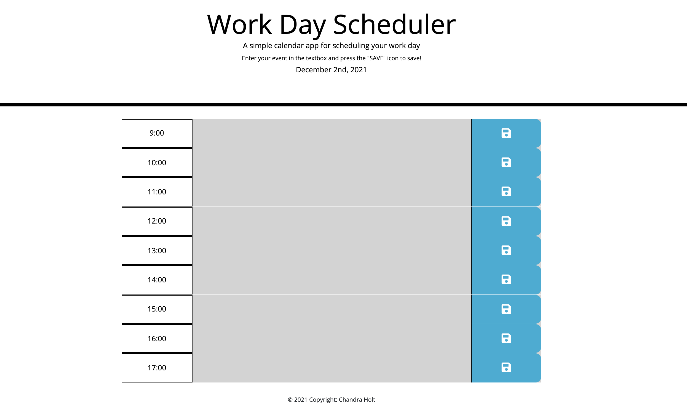

# dirty-work-day-scheduler
A simple calendar application that allows user to save events for each hour of the day.

## Functionality
On page load, user sees the current date at the top of the page. When scrolling down, user is able to view workday times from 0900 to 1700. Each row displays past hours in grey, present in red, and future in green. The user may enter text in any given row and after pressing the "save" icon, the entered text will be saved to the local storage so that upon a refresh of the page, the event is still there.

## Noteworthy Tools
This application was built using jQuery and Bootstrap code. An icon from Font Awesome is utilized as the SAVE key. Bootstrap columns made it possible to format the page in a user-friendly and logical way. 

## User Story

```md
AS AN employee with a busy schedule
I WANT to add important events to a daily planner
SO THAT I can manage my time effectively
```

## Acceptance Criteria

```md
GIVEN I am using a daily planner to create a schedule
WHEN I open the planner
THEN the current day is displayed at the top of the calendar
WHEN I scroll down
THEN I am presented with timeblocks for standard business hours
WHEN I view the timeblocks for that day
THEN each timeblock is color coded to indicate whether it is in the past, present, or future
WHEN I click into a timeblock
THEN I can enter an event
WHEN I click the save button for that timeblock
THEN the text for that event is saved in local storage
WHEN I refresh the page
THEN the saved events persist
```

[Link to Deployed Application](https://chandrapanda.github.io/dirty-work-day-scheduler/)

## Screenshots 


